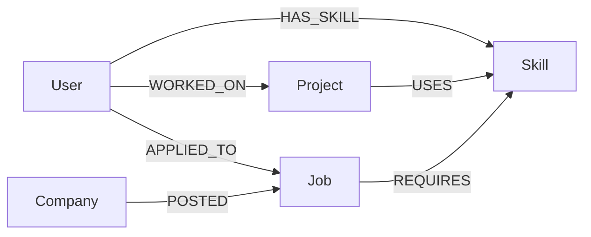

# 🚀 Career Knowledge Graph Platform

> **Wexa AI Take-Home Assignment**  
A full-stack Career Knowledge Graph application built using **React**, **Express.js**, and **CognoDB (Neo4j Compatible)**. The project demonstrates graph database modeling, Cypher queries, graph analytics, recommendation systems, and interactive graph visualization.

---

# 🌐 Submission Links

### 💻 GitHub Repository
https://github.com/Tanmaisutrave/career-knowledge-graph

### 🚀 Live Demo
https://career-knowledge-graph-ten.vercel.app/home

### ⚙ Backend API
https://career-knowledge-graph.onrender.com

### 🎥 Screen Recording
https://drive.google.com/file/d/1x2pn86gc78WvnL36zwsiTlXxBkCUW61w/view?usp=drive_link

---

# 📌 Use Case

Professional networking platforms contain highly connected data where users possess multiple skills, contribute to projects, apply for jobs, and interact with companies.

This application models the ecosystem as a **Knowledge Graph**, allowing efficient graph traversals for:

- Job Recommendations
- Similar User Discovery
- Graph Analytics
- Skill Relationship Analysis
- Shortest Path Queries
- Interactive Graph Visualization

---

# 🌐 Why a Graph Database?

Traditional relational databases require multiple JOIN operations to traverse connected data.

Graph databases directly connect entities through relationships, making multi-hop traversals faster and simpler.

This project uses a graph database to efficiently perform:

- Job recommendations
- Similar user discovery
- Shortest path search
- Relationship analysis
- Connected node analytics

---

# 🧠 Why CognoDB?

CognoDB is a Neo4j-compatible managed graph database supporting the Bolt protocol and Cypher query language.

It was chosen because it provides:

- Neo4j compatibility
- Cypher query support
- Managed cloud hosting
- Fast graph traversals
- Easy deployment

---

# 🏗 Data Model



---

# ✨ Features

- 📊 Interactive Dashboard
- 👥 User Management
- 🧠 Skills Analytics
- 📂 Projects Management
- 🏢 Company Information
- 💼 Job Listings
- 🤖 Job Recommendation Engine
- 🌐 Graph Explorer
- 📈 Graph Analytics
- 🔍 Shortest Path Search
- 📡 REST API

---

# 🛠 Tech Stack

### Frontend
- React 19
- Vite
- Tailwind CSS
- React Router
- Axios
- Recharts
- React Force Graph 2D

### Backend
- Node.js
- Express.js
- Neo4j Driver

### Database
- CognoDB (Neo4j Compatible)

---

# 📁 Project Structure

```
career-knowledge-graph
│
├── client
├── server
├── seed
├── docs
└── README.md
```

---

# ⚙ Creating a CognoDB Instance

1. Create a CognoDB account.
2. Create a new database.
3. Copy the Bolt URI.
4. Get the Username and Password.
5. Add them to `server/.env`.

```env
PORT=5000
COGNODB_URI=
COGNODB_USERNAME=
COGNODB_PASSWORD=
```

Client environment variable:

```env
VITE_API_URL=https://career-knowledge-graph.onrender.com/api
```

---

# 🚀 Installation

Clone the repository

```bash
git clone https://github.com/Tanmaisutrave/career-knowledge-graph.git
```

Install backend

```bash
cd server
npm install
npm start
```

Install frontend

```bash
cd client
npm install
npm run dev
```

Seed database

```bash
cd seed
node seed.js
```

---

# 🧠 Main Cypher Queries

### Job Recommendation

Finds jobs matching a user's skills.

### Similar Users

Finds users with common skills.

### Shortest Path

Finds the shortest connection between a user and a company.

### Graph Statistics

Calculates nodes, relationships, graph density, and degree.

### Top Hiring Companies

Ranks companies based on hiring activity.

---

# 📡 API Overview

```
GET /api/users
GET /api/skills
GET /api/projects
GET /api/companies
GET /api/jobs
GET /api/recommendations/*
GET /api/analytics/*
```

---

# 📷 UI Screenshots

Add your screenshots inside:

```
docs/screenshots/
```

Example:

```markdown
## Home


## Dashboard


## Users


## Skills


## Projects


## Companies


## Jobs


## Recommendations


## Graph Explorer


## Analytics

```

---

# 🚀 Deployment

### Frontend
Vercel

### Backend
Render

---

# 🔮 Future Improvements

- JWT Authentication
- Resume Matching
- Graph Machine Learning
- AI Chat Assistant
- Advanced Search
- Admin Dashboard

---

# 👨‍💻 Author

**Tanmai Sutrave**

B.Tech Computer Science Engineering  
MLR Institute of Technology

GitHub: https://github.com/Tanmaisutrave

---

# 🙏 Acknowledgements

- Wexa AI
- CognoDB
- Neo4j
- React
- Express.js
- Vercel
- Render
