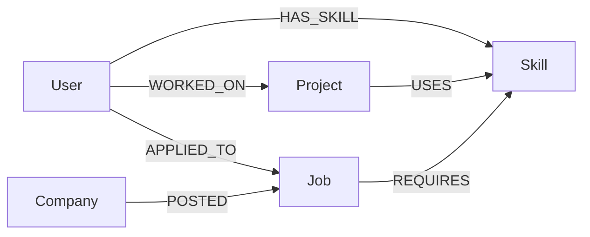

# Career Knowledge Graph Platform

> A production-ready full-stack web application demonstrating graph database capabilities with CognoDB (Neo4j-compatible), built as a take-home assignment for **Wexa AI**.

---

## Overview

The Career Knowledge Graph Platform models professional relationships — users, skills, projects, companies, and jobs — as a **property graph** rather than relational tables. This unlocks multi-hop traversals that are impossible or slow in SQL:

- "Find me jobs matching my skill set" (3-hop path)
- "Who else has a similar profile?" (shared-node traversal)
- "What's the shortest path from me to this company?" (shortest-path algorithm)

---

## Features

| Area | Details |
|------|---------|
| 🗂 Graph Model | 5 node types, 6 relationship types |
| 🔍 Graph Traversals | Multi-hop Cypher queries for recommendations & path-finding |
| 📊 Dashboard | KPI cards + 6 interactive Recharts charts |
| 🌐 Graph Explorer | Interactive ForceGraph2D with zoom, pan, click, hover |
| 🧠 Recommendations | AI-style job matching + similar-user discovery |
| 🔗 Shortest Path | BFS traversal between any user and company |
| 🎨 UI | Dark theme, glassmorphism, Tailwind CSS, smooth animations |
| 📡 REST API | 35+ endpoints across 6 resource routers |
| 🌱 Seed Script | Auto-generates 20 users, 20 skills, 15 projects, 10 companies, 15 jobs |

---

## Tech Stack

**Frontend**
- React 19 + Vite 8
- Tailwind CSS 3
- React Router v6
- Axios
- Recharts
- React Force Graph 2D
- React Icons

**Backend**
- Node.js + Express 5
- Neo4j Driver 5 (CognoDB compatible)
- dotenv, cors

**Database**
- CognoDB Cloud (bolt+s:// protocol, Neo4j-compatible)

---

## Folder Structure

```
Wexa-Graph-Assignment/
├── client/                    # React frontend
│   ├── public/
│   ├── src/
│   │   ├── assets/
│   │   ├── components/
│   │   │   ├── Cards/         # StatCard, UserCard, JobCard
│   │   │   ├── Charts/        # BarChart, PieChart
│   │   │   ├── Navbar.jsx
│   │   │   ├── Sidebar.jsx
│   │   │   └── Loader.jsx
│   │   ├── pages/
│   │   │   ├── Dashboard.jsx
│   │   │   ├── Users.jsx
│   │   │   ├── Skills.jsx
│   │   │   ├── Projects.jsx
│   │   │   ├── Companies.jsx
│   │   │   ├── Jobs.jsx
│   │   │   ├── Recommendations.jsx
│   │   │   └── GraphExplorer.jsx
│   │   ├── services/
│   │   │   └── api.js         # All Axios API calls
│   │   ├── App.jsx
│   │   └── main.jsx
│   ├── tailwind.config.js
│   ├── postcss.config.js
│   └── package.json
│
├── server/                    # Express backend
│   ├── config/
│   │   └── db.js              # Neo4j driver
│   ├── controllers/           # Business logic
│   ├── routes/                # Express routers
│   ├── queries/               # Cypher query strings
│   ├── middleware/            # Error handler
│   ├── utils/                 # neo4jUtils (sanitize, generateId)
│   ├── app.js
│   ├── server.js
│   └── .env
│
├── seed/                      # Database seeding
│   ├── seed.js
│   ├── users.json
│   ├── skills.json
│   ├── projects.json
│   ├── companies.json
│   └── jobs.json
│
├── docs/
│   ├── api-documentation.md
│   ├── cypher-queries.md
│   ├── architecture.png
│   └── graph-diagram.png
│
└── README.md
```

---

## Graph Model



### Node Properties

| Node | Properties |
|------|-----------|
| User | id, name, email, experience, location |
| Skill | id, name, category |
| Project | id, name, description, github |
| Job | id, title, experience, location, salary |
| Company | id, name, industry, website |

---

## Environment Variables

Create `server/.env` (already provided in project):

```env
PORT=5000
COGNODB_URI=bolt+s://db-521da5fb.databases.cognodb.com
COGNODB_USERNAME=cognodb
COGNODB_PASSWORD=<your-password>
```

For the client, create `client/.env` for production builds:
```env
VITE_API_URL=https://your-render-backend.onrender.com/api
```

---

## Installation & Setup

### Prerequisites
- Node.js 18+
- npm 9+

### 1. Clone the repository
```bash
git clone https://github.com/your-username/Wexa-Graph-Assignment.git
cd Wexa-Graph-Assignment
```

### 2. Install backend dependencies
```bash
cd server
npm install
```

### 3. Install frontend dependencies
```bash
cd ../client
npm install
```

### 4. Seed the database
```bash
cd ../seed
node seed.js
```
This will:
- Clear existing data
- Create 20 users, 20 skills, 15 projects, 10 companies, 15 jobs
- Auto-generate all relationships

### 5. Start the backend
```bash
cd ../server
npm run dev
```
Server starts at `http://localhost:5000`

### 6. Start the frontend
```bash
cd ../client
npm run dev
```
App opens at `http://localhost:5173`

---

## API Documentation

See [`docs/api-documentation.md`](docs/api-documentation.md) for the full endpoint reference.

Quick summary:
- `GET /api/users` — list all users
- `GET /api/recommendations/jobs/:userId` — job recommendations
- `GET /api/recommendations/graph/data` — full graph for visualization
- `GET /api/recommendations/path?userId=u1&companyId=c1` — shortest path

---

## Cypher Queries

See [`docs/cypher-queries.md`](docs/cypher-queries.md) for all 15 documented Cypher queries with explanations.

Highlights:
- **Multi-hop job recommendation** (3-hop via shared skills)
- **Shortest path** via `shortestPath()` built-in
- **Collaborative filtering** for similar users

---

## Deployment

### Backend → Render

1. Push code to GitHub
2. Create a new **Web Service** on [render.com](https://render.com)
3. Set Root Directory: `server`
4. Build Command: `npm install`
5. Start Command: `node server.js`
6. Add environment variables:
   - `COGNODB_URI`
   - `COGNODB_USERNAME`
   - `COGNODB_PASSWORD`

### Frontend → Vercel

1. Import repository on [vercel.com](https://vercel.com)
2. Set Root Directory: `client`
3. Framework Preset: **Vite**
4. Add environment variable:
   - `VITE_API_URL` = `https://your-render-service.onrender.com/api`

---

## Future Scope

- [ ] Full-text search across all nodes
- [ ] User authentication (JWT)
- [ ] Skill gap analysis (compare user skills vs job requirements)
- [ ] Company similarity graph (companies sharing skill demands)
- [ ] Graph ML — node embeddings for smarter recommendations
- [ ] Real-time notifications via WebSockets
- [ ] Export graph to PDF / image
- [ ] Admin panel for bulk operations

---

## Author

Built as a take-home assignment for **Wexa AI** — demonstrating graph database modeling, Cypher query engineering, and modern full-stack development practices.
